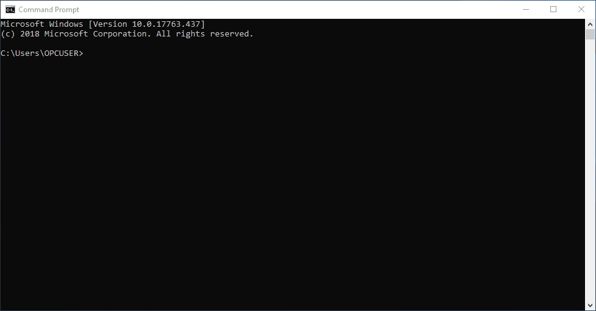
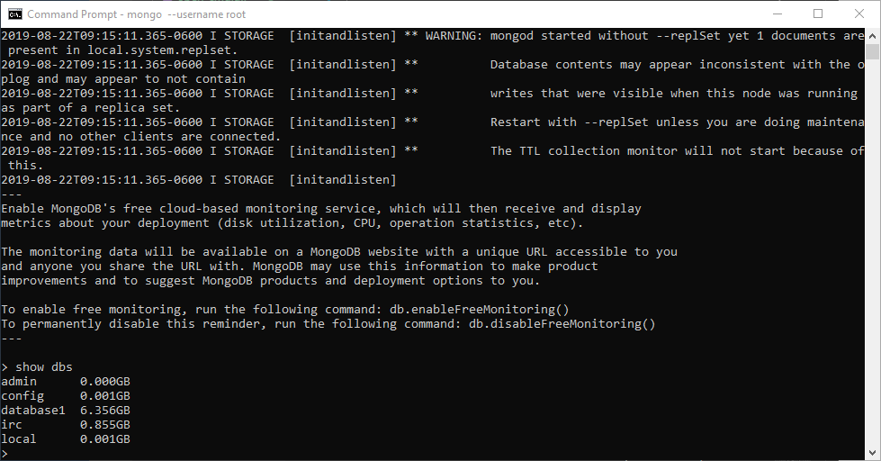
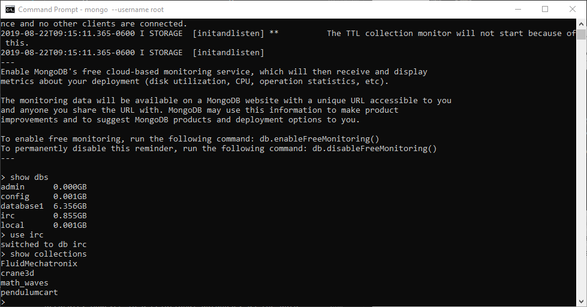
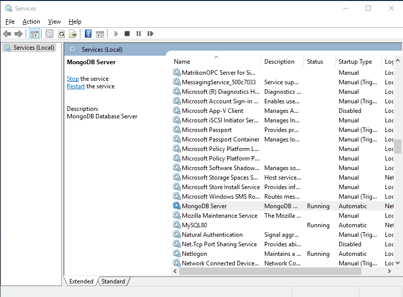
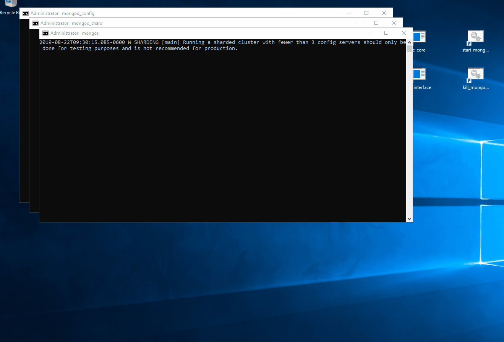

# Databases

## Getting started
In the lab we primarily use mongoDB because we suspect our industry partners are using inmation, and inmation uses mongoDB as their backend service. We have two mongoDB set-ups in the lab: standalone and cluster. The standalone server will be deprecated once the lab has migrated the entire data to the cluster.
### Starting the standalone server
1. Open Window's services by searching 'services' in the taskbar.

2. Look for mongoDB in the list and start the service if it is not running.

3. Check whether the database is running by using the mongo shell to connect to the server.
    1. Open a new command prompt.
    
    2. Type in `mongo --username root`. Type `password` when prompted for a password.
    
    3. Type in `show dbs` to list the databases available in the database
    
    4. Type in `use irc` to browse through the irc database. Then type in `show collections` to see the list of experiments in the irc database.
    
    5. Type in `db.<collection_name>.findOne()` to see the first row of data in the collection. Replace `<collection_name>` with the experiment name listed in `show collections`.
    
4. To kill the database server, simply right click on the mongoDB service and click `Stop`.

### Starting a cluster
1. Run `start_mongo.cmd` on the primary and secondary computers **as Administrator**. Ensure that the standalone mongoDB service is not running as they were set up to use the same IP and port.

2. Check the connection using step 3 in _Starting the standalone server_.
3. To terminate the database cluster, simply run `kill_mongo_cluster.bat` shortcut as Administrator.


## Introduction
A database is simply, a large collection of data. Although spreadsheets (Excel files) can hold large amounts of data, there is a limit to how much data can be stored in one file. With the increasing demand for data, a more robust and efficient system is required, this is where database management systems come in.

Database management systems are classified into two two, although the line is becoming more vague recently, namely: relational and non-relational. Relational databases were invented in the 1970s while non-relational databases were found in the 2000s. Relational databases are built on relational algebra. Users can relate different tables across different databases to ensure consistency. This is part of the relational database’s set of properties, ACID (atomic, consistent, isolated and durable). These set of properties guarantee data on the server will always be reliable and accurate. However in a relational database, as the data intake of the server increase, scaling out becomes more difficult. Adding more computers to the server cluster means each write will have to wait for confirmation from all nodes or computers in the server. This problem is what non-relational databases aim to solve.

Unlike relational databases where most of the data is stored in a “fixed” predefined table, non-relational databases can store key-value, document, column-wide (similar to tables) and graph objects. The main selling point of non-relational databases is semi-fixed schema and horizontal scalability. Because scheme of data is flexible and independent (non-related), data can be added to the server without checking. This means that in a multi-node server cluster, it is possible to write onto any of the node and the rest of the cluster can be notified and updated later. This also means that a non-relational database is only eventually consistent. If data is written to a node, a subsequent read from a different node may not give the most up to date value. 

Taking advantage of non-relational databases’ support for big data, the database project is based on a non-relational database. This project is built on two of the most popular non-relational databases: MongoDB and Cassandra. The two systems are run independently and can run simultaneously.
<br/>
## Cassandra
Cassandra is similar to SQL databases in a sense that it uses a table like structure and uses CQL which is close in syntax to SQL. Keep in mind tables in Cassandra are actually column-wide objects and is therefore implemented differently than SQL tables. Cassandra is also unable to do JOINs as in most SQL databases. In addition, Cassandra was chosen because of its high compression and its read-write performance as a result of its multi-master setup (can write to any node in the cluster). Note that like most database management systems, a single server may host multiple databases. In Cassandra each database is called a keyspace and tables in databases may be referred as column families.

### Required files for installation:
- Apache Cassandra (available from website as tarball)
- Java development kit 1.8 
- Python 2.7 (required to use CQL shell)

Note a higher version of Python may not be supported by CQL therefore make sure the default python interpreter is version 2.7

### Installation
1. Extract the cassandra tarball to C:\
2. Install Java development kit 1.8
3. Install Python 2.7
4. Add `JAVA_HOME` to PATH environment variable
    1. Right click “Properties” on “This PC”
    2. Go to “Advanced system settings”
    3. Click on “Environment Variables”
    4. Under “System variables”, add a new entry with variable name `JAVA_HOME` and set the value to the folder where the java development kit was installed e.g. `C:\Program Files\Java\jdk1.8.0_211`
    5. Double click on the system variable “Path” to modify it
    6. Add new and type in `%JAVA_HOME%\bin` 
5. Add `cassandra\bin` to PATH environment variable (similar to adding `%JAVA_HOME%\bin`)

### Setup
Most of the server settings are located in cassandra.yaml in cassandra\conf. The most important settings are:
- cluster_name: name of cluster to be shared by all nodes in the cluster
- authenticator: set to PasswordAuthenticator to restrict access (require creating users or roles to log in)
- Default super user has username: cassandra, password: cassandra
- authorizer: this should be set to CassandraAuthorizer once authenticator is setup
- rpc_address: this should be set to ip address to bind to for CQL client connections (recommended IP address in local network or IP address in VPN, anything but localhost)
- endpoint_snitch: for possible future expansion, use GossipingPropertyFileSnitch

#### Miscellaneous notes
- Unless setting up for a multi-node cluster, listen_address and seeds can be left as is and there is no need to worry about broadcast addresses
- Disable firewall ports 7000 (for inter-node communication) and 9042 (for CQL client communication) 
- Note that when altering endpoint_snitch after the server has been initialized, the data in the server needs to be cleared out by deleting the data folder

#### Server:  
- Server can be run once the cassandra\bin directory has been added to PATH by opening the command prompt (cmd.exe) and typing
    ```
    $ cassandra -f
    ```  
- -f flag is to indicate cassandra to run in foreground instead of as service (in the background)  
- Server status can be checked by opening a different command prompt and typing
    ```
    $ nodetool status
    ```  
- To stop the server simply Control+C on the terminal running cassandra

### CQL Client
- Open a new terminal or command prompt (other than the one running cassandra)
    ```
    $ cqlsh <rpc-address> -u cassandra -p cassandra
    ```
    -u specifies the username, -p specifies the password to enter
- To create a user or role
    ``` sql
    $ create role <username> with password = ‘<password>’ and login = true;
    ``` 
    To create an admin add “and superuser = true” in the same command as above
    The order of the option specification does not matter (.e.g 
    ``` sql
    $ create role <username> with login = true and password  = ‘password’;
    ```
    Is equivalent to the above  
    `login = true` allows one to use the user or login to log in to the server  
- To see all users (can only be done by superusers or users that have authentication for list roles)
    ``` sql
    $ list roles;
    ```
- To create a database space (keyspace) in a single node cluster with one replication
    ``` sql
    $ create keyspace <keyspace_name> with replication_factor={‘class’: ‘NetworkTopologyStrategy’, ‘dc1’: 1};
    ```
- To list all databases in server
    ``` sql
    $ desc keyspaces;
    ```
- To use the database space
    ``` sql
    $ use <keyspace_name>
    ```
- To create a table 
    ``` sql
    $ create table <table_name>( <column header 1> <type of column header1>, <column header 2> <type of column header 1>, primary key ( <primary key 1>, <primary key 2> );
    ```
    E.g. 
    ``` sql
    create table table1 (pk int, time timeuuid, engine1 float, primary key(pk, time));
    ```
    The first primary key will be used as the partition key (used to determine which node to put the data in) and the optional remaining keys are called clustering keys which can be used to specify order in a single partition  
    If not present in any keyspace the syntax becomes
    ``` sql
    $ create table <keyspace_name>.<table_name> ( <column header 1> <type of column header1>, <column header 2> <type of column header 1>, primary key ( <primary key 1>, <primary key 2> );
    ```
    For more details, refer to the official create table documentation
    https://docs.datastax.com/en/cql/3.3/cql/cql_using/useCreateTable.html  

- To insert values onto the table
    ``` sql
    $ insert into <table name> ( <column header 1>, <column header 2> ) values ( < column 1 value>, <column 2 value>);
    ```
    Note: when inserting values into a table and try to display the values, they may not be listed in order of time of upload. They are sorted according to the hash output by the Murmur3 Partioner. For time series data, refer to https://www.datastax.com/dev/blog/we-shall-have-order for a possible solution. In single node setups, using byte order partition scheme will not impact performance (data automatically sorted by partition key).  
- To read from the table
    - To get all columns in the table
        ``` sql
        $ select * from <table_name>
        ```
    - To get specific columns in the header
        ``` sql
        $ select <column header 1>, <column header 2> from <table_name>
        ```
    For more detailed query statements, there is great documentation by DataStax https://docs.datastax.com/en/cql/3.3/cql/cql_reference/cqlSelect.html  
- To properly close CQL connection 
    ```
    $ exit
    ```
### MATLAB

#### Prerequisite:
- Install MATLAB Database Toolbox
- Install Database Toolbox Interface for Apache Cassandra Database https://www.mathworks.com/help/database/ug/database-toolbox-interface-for-apache-cassandra-database-installation.html

#### Interface:
- Establish connection and authentication
    ``` Matlab
    conn = cassandra(contactPoint, username, password)
    ```
    contactPoint is RPC address of cassandra server (as a string)  
    username and password are strings  
- Read data from server
    ``` Matlab
    var = partitionRead(conn, <keyspace_name>, <table_name>)
    ```
    conn here is from step1  
    var is now a table containing all the values of <keyspace_name>.<table_name>
    <br/>
    Unfortunately, if data cannot be fetched in one batch by MATLAB (e.g. out of memory) the data cannot be read using partitionRead, CQLqueries must be used and the data partition must be known before upload, refer to https://www.mathworks.com/help/database/ug/import-data-from-cassandra-database-table-using-cql.html  
    Tip: to iterate through all data in database, use SELECT DISTINCT query to retrieve all partition keys and use those partition keys in SELECT WHERE query
<br/>
## MongoDB
MongoDB is the most popular NoSQL database due to its Document based model, allowing for highly unstructured data. As a drawback, memory space may not be as efficient because fields are stored in each row (referred to a document in mongo). Although mongoDB supports clustering, it is still a single master setup where writes can only be done through one node. In the event that the master node dies, one slave node will automatically be promoted to a master. Note that in MongoDB, tables are referred to as collections and each entry in a collection (equivalent to a row in a table) is referred to as a document. https://docs.mongodb.com/manual/core/data-modeling-introduction/

### Installing MongoDB (install as a service)  
Go through the [official documentation](https://docs.mongodb.com/manual/tutorial/install-mongodb-on-windows/) for quick installation using setup executable given. Follow the instructions up until step 3 (before launching mongo.exe). Installing the software as a service is recommended. This way you can run a mongo server in the background without worrying about accidentally closing the terminal window that handles that process.
### Server setup
1. Navigate to mongoDB’s binaries folder
    ```
    $ cd C:\Program Files\MongoDB\Server\4.0\bin
    ```
2. Edit mongod.cfg, set bindIP to be local IP address (or IP address in VPN) so that remote computers in the same network can access the mongo database
3. Initially set 
    ```
    security:
      authorization: “disabled”
    ```
4. Check if server is running by opening “Services” from Windows taskbar and search for mongoDB server

### Running the server
1. Open command prompt as administrator and navigate to mongoDB’s binary folder
    ```
    $ cd C:\Program Files\MongoDB\Server\4.0\bin
    ```
2. Run 
    ```
    $ mongod --config mongod.cfg
    ```
    This will load the configuration file mongod.cfg found in the same folder as mongod.exe
3. To stop the server, simply Control+C the terminal running mongod or open “Services” in Windows and stop mongoDB server from there

### mongo shell (intial setup)
1. To use mongoshell, open a command prompt and navigate to mongoDB’s binary folder
    ``` 
    $ cd C:\Program Files\MongoDB\Server\4.0\bin
    ```
2. To connect to remote host using mongo shell
    ``` 
    $ mongod --host <host_ip_address> --port 27017
    ```
    E.g. 
    ```
    $ mongod --host 192.168.1.2 --port 27017
    ```
    The default port mongoDB binds to is 27017 (automatically exempted by firewall upon installation)
3. To view databases in server
    ```
    $ show dbs
    ```
4. To setup authorization and authentication
    ```
    $ use admin
    ```
    Admin is a special database managed internally by mongo and is automatically    created in every server
    - To create a super user
    ``` javascript
    $ db.createUser({user: <username>, pwd: <password>, roles:[“root”]});
    ```
    - To generate a general user
    https://docs.mongodb.com/manual/reference/method/db.createUser/  
    - The “root” role indicates the specified user is a super user  
    - Note that each user is associated to a database where it was created. In step 4, db here refers to the admin database so db.createUser associates each user to admin database, i.e. the authentication database of each user is the admin database. A user with the same name created in different databases are two completely unique users.
5. To see users in database
    ``` javascript
    $ db.getUsers()
    ```
7. To close the mongo shell connection
    ``` 
    $ exit
    ```
8. Stop mongoDB server and enable authentication by modifying mongod.cfg as
    ```
    security:
      authorization: “enabled”
    ```
    Then re-run the server
    To log in to mongoDB server with authentication, either use:
    ``` 
    $ mongod --username <username> --authenticationDatabase <which database was the 
    user created in> --password <password> --host <host_ip_address> --port 27017
    ```
    Note: password is optional, it is even recommended not to include the --password flag. Leaving it blank will ask for a password invisible for anyone to see.
    ```
    $ mongod “mongodb://<username>:<password>@<host_ip_address>:<port>/<authentication_database>”
    ```
    Note: this style is called using a URI style connection string, this style will most likely be used to connect to a mongoDB server using one of the many supported programming languages. Refer to https://docs.mongodb.com/manual/mongo/ for official documentation.

### MATLAB
#### Prerequisite: 
- Install MATLAB Database Toolbox
- Install DatabaseToolbox Interface for MongoDB https://www.mathworks.com/help/database/ug/database-toolbox-interface-for-mongodb-installation.html

#### Interface:
1. Establish a connection and authentication
    ``` Matlab
    conn = mongo(<host_ip_address>, <port>, <authentication_database>, ‘UserName’, <username>, ‘Password’, <password>);
    ```
    Default port is 27017, the ‘UserName’ and ‘Password’ arguments are required to specify the following username and password arguments respectively according to official documentation https://www.mathworks.com/help/database/ug/mongo.html.
2. Read data from server
    ``` Matlab
    var = find(conn, <collection_name in database>)
        var is now a struct array of the collection
    ```
    If out of memory exception occurs when attempting to read big data, refer to https://www.mathworks.com/help/database/ug/import-large-data-from-mongodb.html to import the data in batches.

### Sharded cluster
One of the advantages of using NoSQL databases is the ability to scale horizontally, where data is distributed across multiple nodes for high availability and load balancing.

##### Background
A mongoDB cluster consists of three key components: a router (mongos.exe), a config server and sharding servers.
| Component | Function |
|---|---|
| router | Serves clients and communicates between config server and sharding server. |
| config server | Knows how and where the data is distributed. If this server dies, clients cannot retrieve anything from the database |
|sharding server | Where the data is actually stored. A cluster can have multiple shards. |

The config and sharding servers are usually implemented as _replica sets_. Replica sets are collections of nodes that maintain the same database. A production replica set should be in odd numbers of at least 3. This way there will always be majority vote in case the primary node in that replica set dies. Arbiter nodes can be added to the replica set to participate in elections only and not store data. 

#### Lab Setup

Currently we have a 5 node setup running on 2 computers: CME-712337 and CME540319 (Pendulum cart computer). CME-712337 acts as the router, config server and one of the nodes in a shard replica set while CME540319 acts as the other node in the shard replica set and an aribter node of the same shard replica set. Replica sets should contain at least 3 members for fault tolerance. In the event of a primary node failure, re-election can properly be executed only if there is majority vote.

> If a replica set has an even number of members, add an arbiter.

The routers are set up with the port 27017, the config servers 27018, sharding nodes 27019, and arbiter nodes 27020. 

#### Shading a collection:
1. Create an index for that collection by:
    1. Using mongoshell, navigate to collection, example:
        ```javascript
        use irc;
        ```
    2. Determine collection and key to be indexed:
        ```javascript
        db.collection.createIndex({"key": 1});
        ```
        example:
        ```javascript
        db.crane3d.createIndex({"time": 1});
        ```
        Full details about the operation can be found in the official documentation [here](https://docs.mongodb.com/manual/reference/method/db.collection.createIndex/).
2. Connect to the mongos instance for the cluster using the mongo shell and use
    ```javascript
    sh.shardCollection("irc.crane3d", {"time": 1});
    ```
<br/>
## MySQL
<!-- introduction to MySQL -->

### Installation
<!-- refer to binary setup in windows -->

### Usage
<!-- SQL Language -->