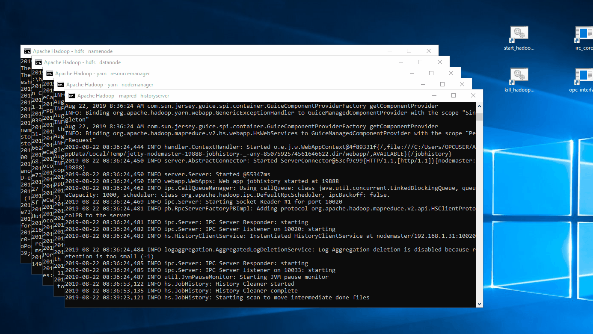

# Hadoop
Hadoop is the distributed computing framework based off of Google's file system (GFS) and Google's Map Reduce research papers. Hadoop allows big data analytic tasks to be distributed across multiple machines instead of having one super computer. This approach allows for massive scaling in the future. 

Currently, a Hadoop 3.1.2 is installed in computers 192.168.1.31 and 192.168.1.26 (running 64 bit Windows). [Single cluster setup (pseudodistributed mode guide)](https://hadoop.apache.org/docs/r3.1.2/hadoop-project-dist/hadoop-common/SingleCluster.html). Hadoop is usually installed in a UNIX environment with lots of commodity hardware to maximize parallel computation, but due to constraints, we had to setup a Windows cluster instead. I tried to use VM's to run Ubuntu but the VM's ran extremely slow.

## Getting started
1. Start the Hadoop cluster by running `start_hadoop.cmd` shortcut found in the Desktop **as Administrator** on each of the nodes. At the time of writing, you only need to run `start_hadoop.cmd` on CME540319 and CME-712337.


2. Ensure that the services are running by checking if there are any **shutdown messages** towards the end of the command prompt. The primary computer should run the services: resourcemanager, namenode, and history server. The secondary computers should run: datanode and nodemanager. Details about each of these services can be found in the documentation below. If anything goes wrong, refer to the troubleshooting section in the document below. <!-- TODO: troubleshooting section-->
3. Wait until namenode exits safemode before running any MapReduce job.
4. Submit a MapReduce job to the cluster. In computer CME-712337, I have prepared sample code to run a MapReduce job. The job analyses Seattle's 9GB library inventory data and finds the number of books for each subject/genre.
Simply navigate to `C:\Users\OPCUSER\Documents\library_analysis` and run `run.cmd`.
5. Stop the cluster, simply run the `kill_hadoop.cmd` shortcut as administrator and the command prompts should automatically close.



## Installation 
Make sure that JAVA_HOME is set in your environment and does not contain any spaces. If your default Java installation directory has spaces then you must use the short pathname instead e.g. `c:\PROGRA~1\Java\...` instead of `C:\Program Files\Java\....`. Hadoop is currently installed in `C:\hadoop`. 

### Single node cluster

1. Download binaries [from ASF Hadoop download page](http://mirrors.ibiblio.org/apache/hadoop/common/) (e.g. `hadoop-3.2.0.tar.gz`). Otherwise, build from source, but has lots of dependencies. 
    - ***The included binaries do not include _winutils.exe_*** which is required for Hadoop, download the binaries from [cdarlint/winutils](https://github.com/cdarlint/winutils) finding the appropriate version. Place these files in the binaries folder of Hadoop (i.e. `C:\hadoop\bin`)
2. The [_Starting a Single Node (pseudo-distributed) Cluster_](https://cwiki.apache.org/confluence/display/HADOOP2/Hadoop2OnWindows#Hadoop2OnWindows-StartingaSingleNode(pseudo-distributed)Cluster) section in the official [wikipage](https://cwiki.apache.org/confluence/display/HADOOP2/Hadoop2OnWindows) was used as reference. I discarded a few configuration properties in the xml files as it runs fine without it. In summary here are my changes:
    - core-site.xml
        ```xml
        <configuration>
            <property>
                <name>fs.defaultFS</name>
                <value>hdfs://localhost:9000</value>
            </property>
        </configuration>
        ```
    - hdfs-site.xml
        ```xml
        <configuration>
            <property>
                <name>dfs.replication</name>
                <value>1</value>
            </property>
        </configuration>
        ```
    - mapred-site.xml
        ```xml
        <configuration>
            <property>
                <name>mapreduce.framework.name</name>
                <value>yarn</value>
            </property>
            <property>
                <name>mapreduce.jobhistory.address</name>
                <value>localhost:10020</value>
            </property>
            <property>
                <name>mapreduce.jobhistory.webapp.address</name>
                <value>localhost:19888</value>
            </property>
        </configuration>
        ```
    - yarn-site.xml
        ```xml
        <configuration>
            <property>
                <name>yarn.nodemanager.aux-services</name>
                <value>mapreduce_shuffle</value>
            </property>

            <property>
                <name>yarn.log-aggregate-enable</name>
                <value>true</value>
            </property>

            <property>
                <name>yarn.log.server.url</name>
                <value>http://localhost:19888/jobhistory/logs</value>
            </property>
        </configuration>
        ```
        note that you may set `yarn.log-aggregate-enable` to `false` but this will prevent you from reading the logs from the web UI.
3. If this is the first time that the server is initialized, or there is a "Datanode incompatible" error, make sure to reformat the namenode using
    ```bat
    bin\hdfs namenode -format
    ```
    Note that this will essentially mean losing all the data in the hadoop cluster, as there is no way of recovering how the file system was constructed.
3. To start the file system, run an **administrator command prompt** (preferrably cmd), navigate to the installation directory (here it is `C:\deploy`), and run
    ```bat
    sbin\start-dfs.cmd
    ```
4. To start _YARN_, in an administrator command prompt, navigate to the installation directory (can use old prompt), and run
    ```bat
    sbin\start-yarn.cmd
    ```
5. Optionally if you have set log-aggregate-enable to true, you need to run the _JobHistoryServer_. Which can be run using
    ```bat
    bin\mapred historyserver
    ```

### Fully distributed cluster
1. Download binaries [from ASF Hadoop download page](http://mirrors.ibiblio.org/apache/hadoop/common/) (e.g. `hadoop-3.2.0.tar.gz`). Otherwise, build from source, but has lots of dependencies. 
    - ***The included binaries do not include _winutils.exe_*** which is required for Hadoop, download the binaries from [cdarlint/winutils](https://github.com/cdarlint/winutils) finding the appropriate version. Place these files in the binaries folder of Hadoop (i.e. `C:\hadoop\bin`)
2. Set-up environment variables:
    - JAVA_HOME: (no spaces, use short names e.g. `PROGRA~1/Java` instead of `Program Files/Java`)
    - HADOOP_HOME: `C:\hadoop`
3. Edit C:/Windows/System32/Drivers/etc/host to:
    ```
    192.168.1.31 nodemaster
    192.168.1.26 node1
    XXX.XXX.XXX.XXX nodeX  # fill in as needed
    ```
    matching IP addresses or DNS addresses to their named roles.
4. Append to hadoop-env.cmd in %HADOOP_HOME%/etc/hadoop:
    ```bat
    set HADOOP_PREFIX=%HADOOP_HOME%
    set HADOOP_CONF_DIR=%HADOOP_PREFIX%\etc\hadoop
    set YARN_CONF_DIR=%HADOOP_CONF_DIR%
    set PATH=%PATH%;%HADOOP_PREFIX%\bin
    ```
5. Edit the configuration section in `core-site.xml`:
    ```xml
    <configuration>
        <property>
            <name>fs.default.name</name>
            <value>hdfs://nodemaster:9000</value>
        </property>
    </configuration>
    ```
6. Edit the configuration section in `hdfs-site.xml`:
    ```xml
    <configuration>
        <property>
            <name>dfs.replication</name>
            <value>1</value>
        </property>
        <property>
            <name>dfs.namenode.name.dir</name>
            <value>/hadoop/dfs/namenode_logs</value>
        </property>
        <property>
            <name>dfs.datanode.data.dir</name>
            <value>/hadoop/dfs/data</value>
        </property>
    </configuration>
    ```
7. Edit the configuration section in `mapred-site.xml`:
    ```xml
    <configuration>
        <property>
            <name>mapreduce.framework.name</name>
            <value>yarn</value>
        </property>
        <property>
            <name>mapreduce.jobhistory.address</name>
            <value>nodemaster:10020</value>
        </property>
        <property>
            <name>mapreduce.jobhistory.webapp.address</name>
            <value>nodemaster:19888</value>
        </property>
    </configuration>
    ```

8. Edit the configuration section in `yarn-site.xml`:
    ```xml
    <configuration>
        <property>
            <name>yarn.nodemanager.aux-services</name>
            <value>mapreduce_shuffle</value>
        </property>
        <property>
            <name>yarn.resourcemanager.hostname</name>
            <value>nodemaster</value>
        </property>
        <property>
            <name>yarn.log-aggregation-enable</name>
            <value>true</value>
        </property>
          <property>
            <name>yarn.log.server.url</name>
            <value>http://nodemaster:19888/jobhistory/logs</value>
        </property>
    </configuration>
    ```
9. Configure `workers` in `%HADOOP_HOME%/etc/hadoop` to:
    ```
    nodemaster
    node1
    ```
    assuming nodemaster is also running an instance of datanode and nodemanager.
10. Repeat all the above configurations on the secondary nodes.
11. To run the cluster, run namenode, resourcemanager, and historyserver on the primary node using:
    ```bat
    bin\hdfs namenode
    bin\yarn resourcemanager
    bin\mapred history server
    ```
    and on the secondary nodes:
    ```bat
    bin\hdfs datanode
    bin\yarn nodemanager
    ```
    note that these are all separate commands that should be run as administrator. I have written a batch script that automatically starts the above components **assuming HADOOP_HOME is set as an environment variable**. The scripts can be found in `Documents/armianto/scripts`

## MapReduce Framework
MapReduce is used to analyze big data that does not fit in memory. If the data can fit in memory, it is better to do so using traditional means. Traditionally because Hadoop is written in Java, MapReduce jobs are best written in Java. The map phase basically 
### Streaming
[Hadoop Streaming official documentation](https://hadoop.apache.org/docs/r3.0.3/hadoop-streaming/HadoopStreaming.html)
By default, the prefix of a line up to the first tab character is the key and the rest of the line (excluding the tab character) will be the value

#### How many Reducers in Hadoop:
Job.setNumreduceTasks(int) the user set the number of reducers for the job.
The right number of reducers are 0.95 or 1.75 multiplied by (<no. of nodes> * <no. of the maximum container per node>).
With 0.95, all reducers immediately launch and start transferring map outputs as the maps finish.
With 1.75, the first round of reducers is finished by the faster nodes and second trend of reducers is launched doing a much better job of load balancing.

It is safe to assume the number of containers in 

##### configure number of reducers
https://stackoverflow.com/questions/51758601/what-does-the-number-of-maximum-containers-per-node-mean-in-hadoop
##### configure node resources
https://stackoverflow.com/questions/26540507/what-is-the-maximum-containers-in-a-single-node-cluster-hadoop/26541051

